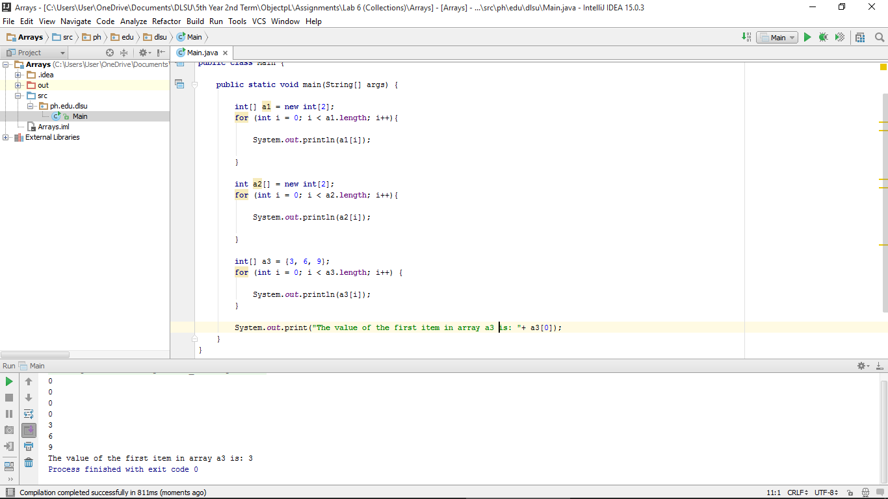

#Arrays

Learning to declare arrays in different ways.

#ScreeShot

#Code

~~~
package ph.edu.dlsu;

public class Main {

    public static void main(String[] args) {

        int[] a1 = new int[2];
        for (int i = 0; i < a1.length; i++){

            System.out.println(a1[i]);

        }

        int a2[] = new int[2];
        for (int i = 0; i < a2.length; i++){

            System.out.println(a2[i]);

        }

        int[] a3 = {3, 6, 9};
        for (int i = 0; i < a3.length; i++) {

            System.out.println(a3[i]);
        }

        System.out.print("The value of the first item in array a3 is: "+ a3[0]);
    }
}
~~~
